# SecureBankApp

(Hopefully) secure bank application.
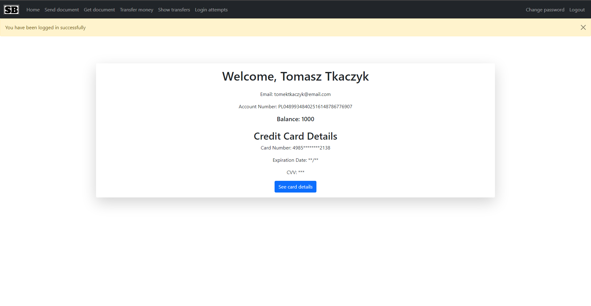

## Requirements

You just need Docker!

## To run with docker

```shell
docker compose up --build
```

---

### Features

- **User Authentication:**
  - User can register to create an account.
  - 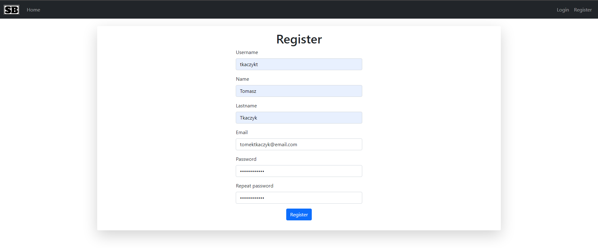
  - Random password combinations during log in enhance security.
  - 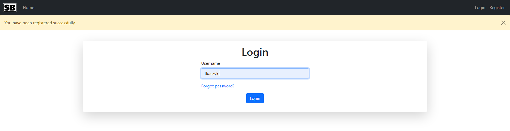
  - 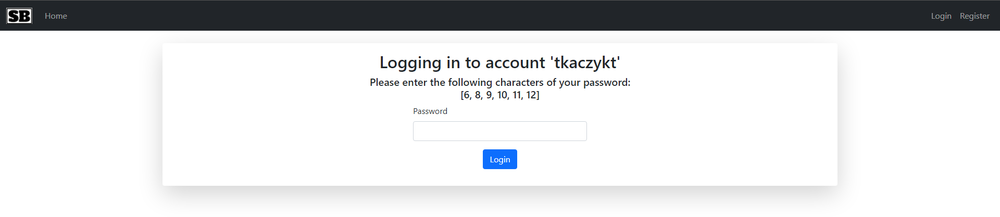
  - User can change password.
  - 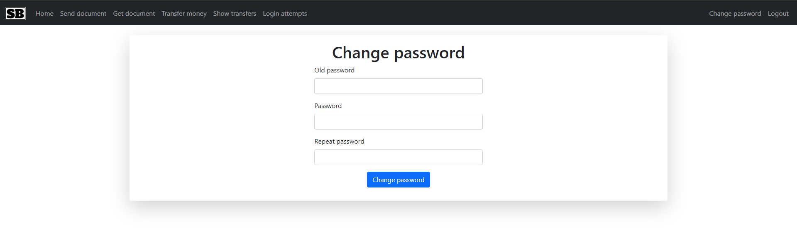

- **Log in Attempts:**
  - User can see his login attempts.
  - 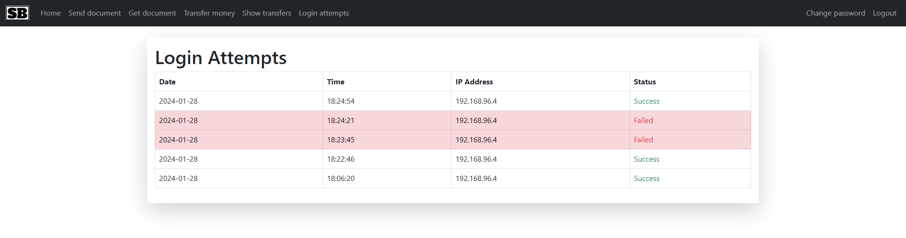

- **Money Transactions:**
  - Secure money transfer functionality.
  - 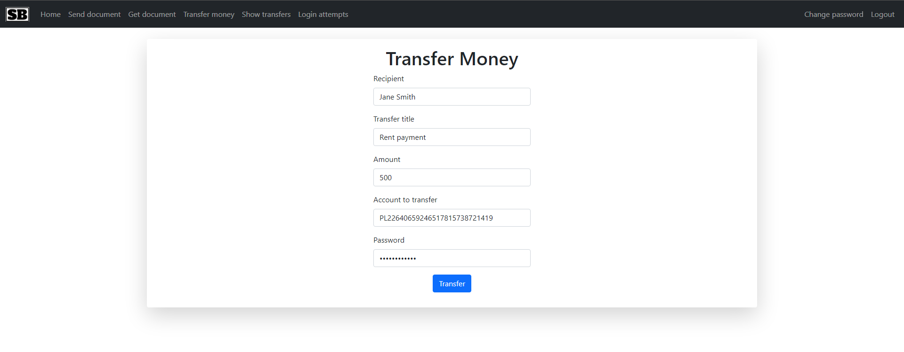
  - View transaction history.
  - 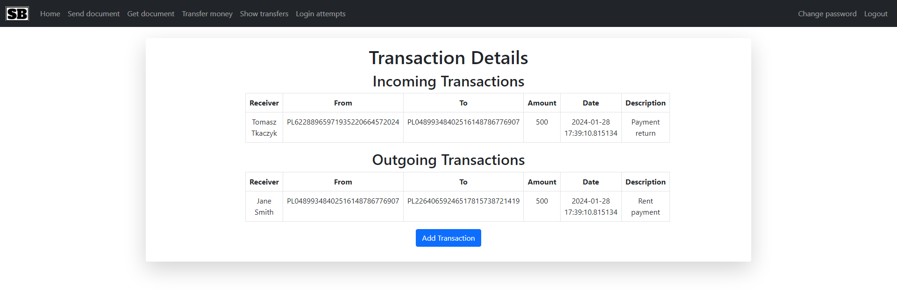

- **Document Management:**
  - Upload and manage encrypted documents securely.
  - 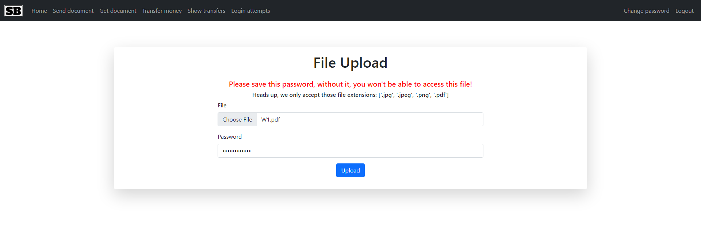
  - 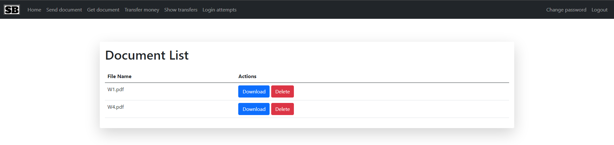
  - Access and delete documents with proper authentication.
  - 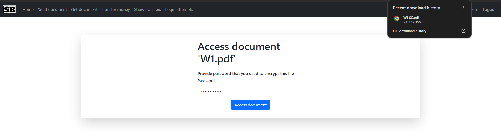
  - 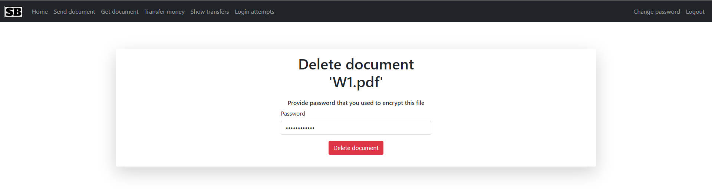

- **Password Recovery:**
  - Password recovery process with email verification.
  - 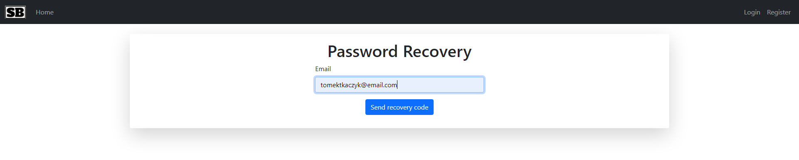
  - Set a new password after password recovery.
  - 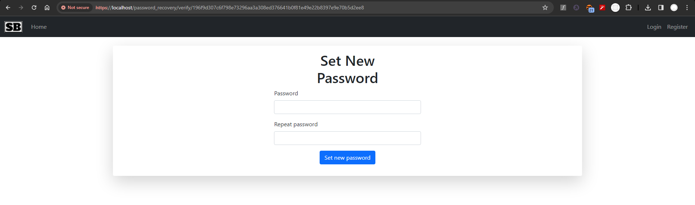

- **Security Measures:**
  - CSRF protection with Flask-WTF.
  - Login attempts tracking and security timeouts.
  - Password strength checks and secure password storage.

- **HTTPS and SSL Protocol**
  - HTTPS protocol with SSL certificate.
  - SSL certificate generated with OpenSSL.
  - 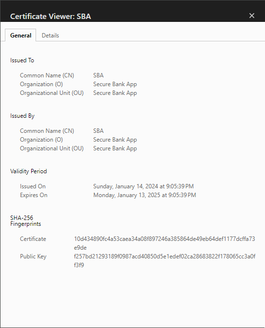

- **Responsive design**
  - App can be accessed from mobile devices.
  - 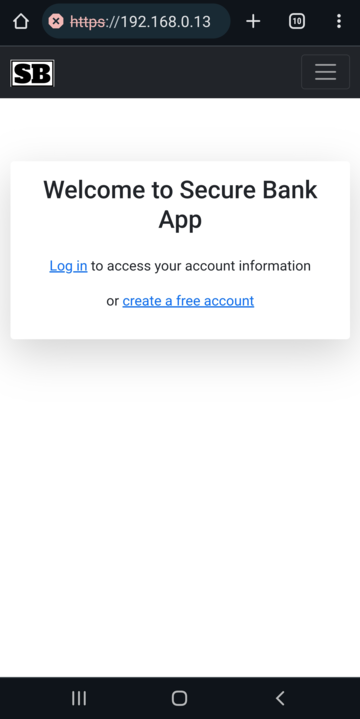
  - 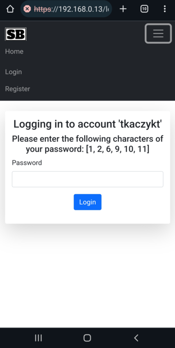
---

### Project Structure

- **config:** Contains configuration files, including server settings and timeouts.
- **models:** Database models for users, credentials, transactions, login attempts, credit cards, documents, and
  password recovery codes.
- **forms:** Web forms for user input validation, including login, registration, transfer, document management, password
  recovery, and password change.
- **views_helper:** Helper functions for password-related operations and user authentication.
- **helpers:** Additional helper functions, including password strength checking.

---

### Technologies

- **Flask:** Web framework for Python.
- **Flask-WTF:** Form validation and CSRF protection.
- **Bootstrap:** Front-end framework.
- **Jinja2:** Template engine for Python.
- **SQLAlchemy:** ORM for Python.
- **PostgreSQL:** Database.
- **bcrypt:** Password hashing.
- **PyCryptodome:** Encryption and decryption.